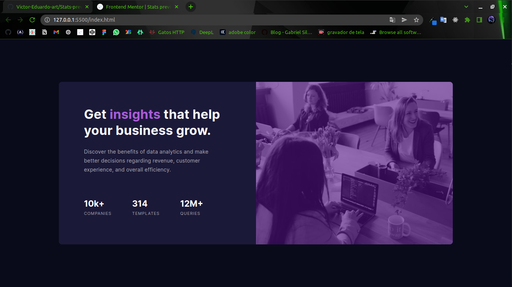

# Frontend Mentor - Stats preview card component 

fale um pouco do projeto/repositório

## Screenshot

## Checklist do que adicionar no projeto
 <!--aqui faça uma checklist das funções que você quer adicionar no projeto  -->

- [ ] Escrever o README.md
- [ ] colocar o projeto no ar
- [ ] deixar responsivo

## Como criei o projeto
<!-- coloque aqui os passo (claro que você pode colocar as coisas que você achar mais relevantes) que você fez para criar o projeto -->

### Tecnologias
<!-- liste algumas tecnologias que você usou no projeto, exemplo -->

- HTML
- CSS
- FlexBox

### minha maior dificuldade
<!-- coloque aqui sua maior dificuldade, como você fez para solucionar ela ou peça ajudar para o leitor em relação a sua dificuldade, também mencione o artigo ou usuário que te ajudou a resolver  -->

### O que aprendi
<!-- coloque aqui o que você aprendeu nesse projeto -->

## Links
<!-- coloque links sobre o projeto, como um protótipo no ar -->
[link que o usuário vai querer acessar](http://teste.com)

## Créditos
<!-- coloque aqui os conteúdos ou usuário que ajudaram a criar o projeto -->

## Autor
<!-- coloque links relacionados as suas redes sociais -->

[Minhas principais redes sociais](https://linktr.ee/victor_eduardo_art)